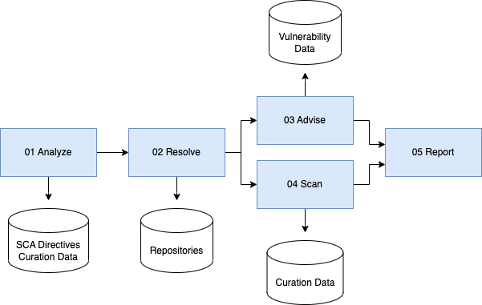

# metaeffekt-examples

Repository providing examples on SCA results, SBOM exports and concluded reports.

The examples are meant to create a common understanding regarding SBOM content, SBOM validation and SBOM-centric use 
cases, as well as provide an introduction into the tools and capabilities of {metaeffekt}. This repository
showcases how many of our tools can be used in practice with little to no pre-existing knowledge of our processes.

## How to use this repository

This repository is split into three major sections.

### Example Assets

Each example asset is contained in its own top level directory consisting of subdirectories which correlate to the basic
pipeline steps explained below. All documents and files produced for this example by their respective stage can be found here.
More information on what documents should be contained in each stage and what anomalies are to be expected can be found in
the example-specific subdirectories.

### Maven processors

The processor directory consist of the maven pom.xml files necessary to execute the different steps making up the basic pipeline.
While these files can be executed manually via maven, they are mostly used in conjunction with our GitHub actions workflow described
below. 

While most maven executions can be executed locally without additional resources, some require resources such as properties
files, vulnerability and license databases and more. Some of these resources can be found in the processors/resources directory
while others are managed on an "as-needed" basis by our GitHub actions.

### GitHub actions

GitHub actions serve as a way to showcase how the entirety of our pipeline is built and connected, as well as which configurations
are available. Larger and more complex workflows are defined by either connecting multiple smaller workflows in so-called "caller"
workflows or made up of many composite actions, defined in the .github/actions directory.

To easily understand how the workflows are built exactly, we would recommend taking a look at the inventory-to-cyclonedx workflow,
as it only calls a small number of composite actions.

## Evaluation Process

The example structure follows a baseline pipeline:



Each example will provide the following (or a subset) of folders to collect various data
on the different stages.

### 01-analyzed

The software asset is analyzed applying different tools; the results are gathered.
This step only covers a pure identification of software components, as far as the used
tools support this objective.

### 02-resolved

The inventory with identified software is passed through a resolver to expand
the details for each identified artifact. The resolver enriches artifacts with additional information
currently not present, such as deloyable URIs, PURLs, Organization data and more.

### 03-advised

The resolved inventory is run through an advisor to add vulnerability and advisory
details for each artifact.

### 04_scanned

The resolved inventory and the collected representations for each artifact are
scanned for licenses and copyrights.

### 05_reported

The scanned inventory and the advised inventory are used to generate a variety of reports.

## SBOM Validation

Simple code to reproduce the validation output:

### Spdx 2.3
```java
final File file = new File("keycloak-25.0.4-spdx-2.3_spdx-exporter_current.json");
final SpdxDocument spdxDocument = SpdxToolsHelper.deserializeDocument(file);
final List<String> verify = spdxDocument.verify("2.3");
verify.forEach(System.out::println);
```

### Spdx 3.0.1
```java
final File file = new File("keycloak-25.0.4-spdx-3.0.1_spdx-exporter.json");
final SpdxDocument spdxDocument = SpdxToolsHelper.deserializeDocument(file);
final List<String> verify = spdxDocument.verify("3.0.1");
verify.forEach(System.out::println);
```

### CycloneDX
```java
final File file = new File("keycloak-25.0.4-cyclone-dx-1.6_exporter.json");
List<String> results = new ArrayList<>();
results.addAll(
        new JsonParser()
        .validate(bomFile).stream().map(Throwable::getMessage)
        .collect(Collectors.toList()));
results.forEach(System.out::println);
```

## License

The examples and related content provided by {metæffekt} is licensed under [Creative Commons BY-4.0](LICENSE) if not
specified otherwise.

Copyright © metaeffekt GmbH 2021-2024. All rights reserved.

The different examples may contain different data licenses for the conveyed content. E.g. SPDX documents are usually
distributed under CC0-1.0.

## Disclaimer

This is all work in progress and subject to continuous improvement.

No information in this repository is meant to offend or criticize. The content is rather indented to foster
collaboration and harmonization of the tools we apply. Not at least we identify and communicate challenges to be tackled.

All company names, organization names, license names, and product names mentioned in this repository are used for
identification purposes only.

## Contributions

Feel free to contribute. The general agreement is that your contribution must be either under Creative Commons BY-4.0
(CC-BY-4.0) or Creative Commons Zero 1.0 (CC0-1.0).

Commits require sign-off.