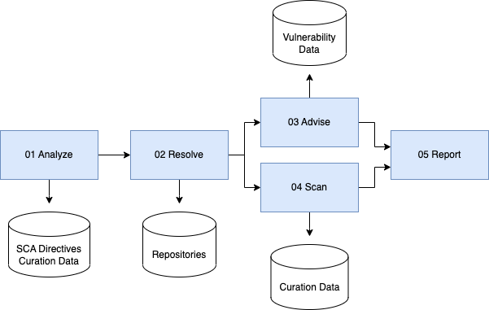

# Curated

This step and the _scanned_ step form a loop as can be seen in the graphic below. A scanned inventory can be 
curated to fill artifacts and assets with additional information which could not be gathered by our previous 
pipeline steps. The curated inventory is then scanned again to fill licenses and copyrights and the cycle continues 
until we are satisfied with the end result.

